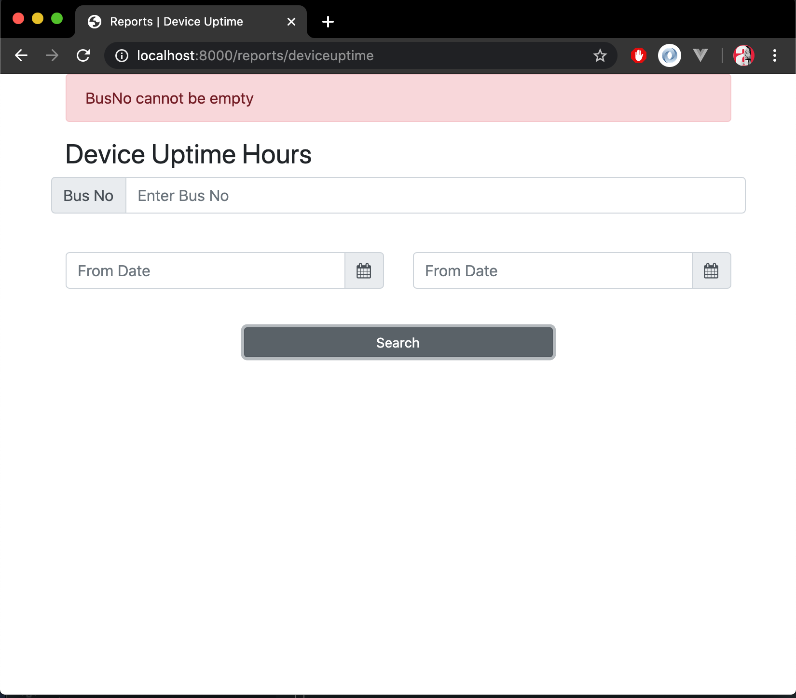
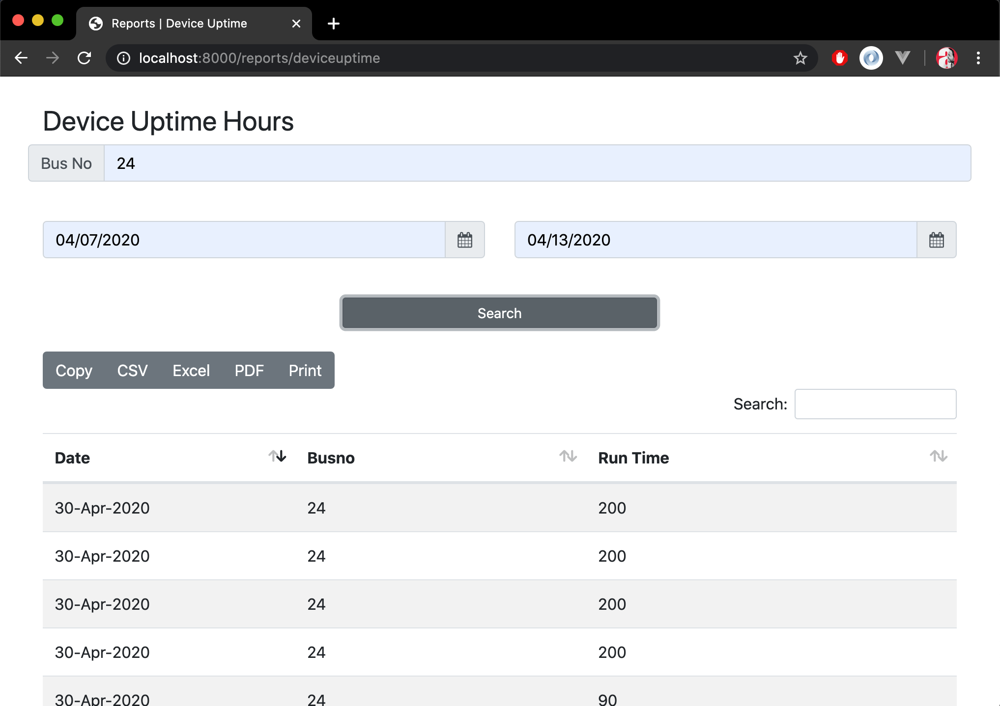
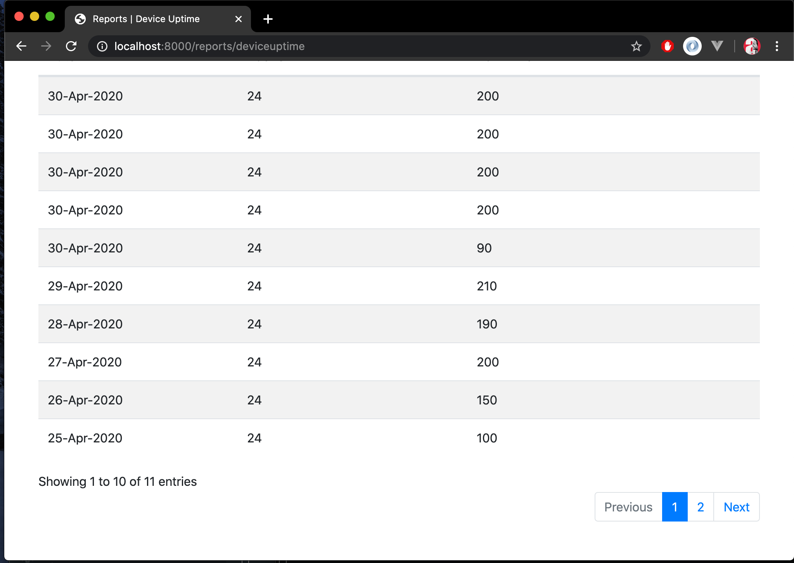
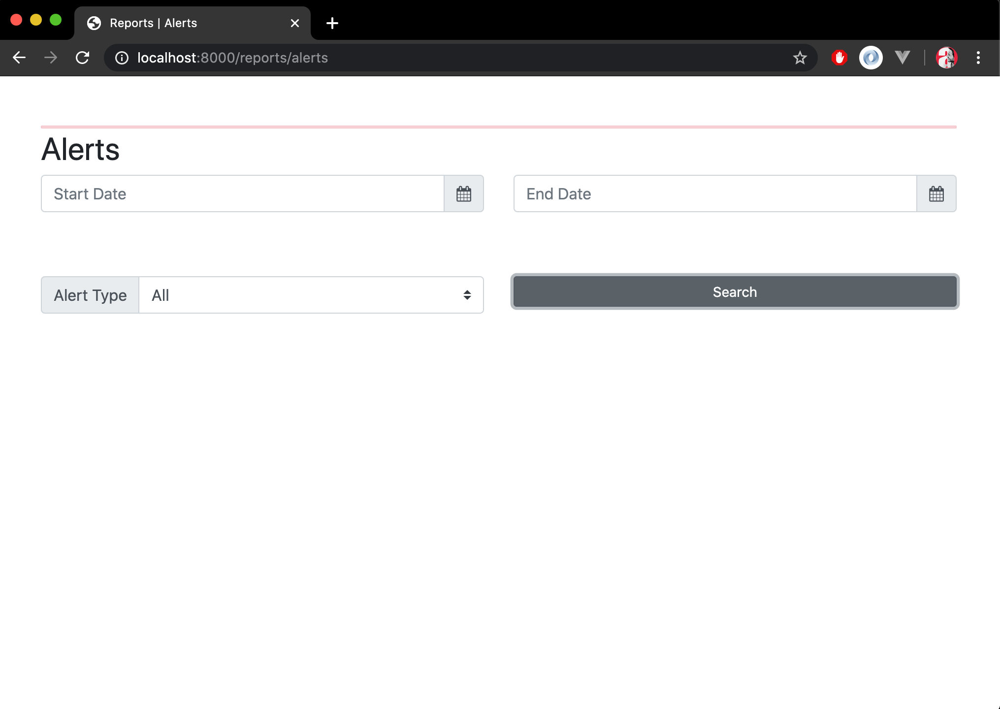
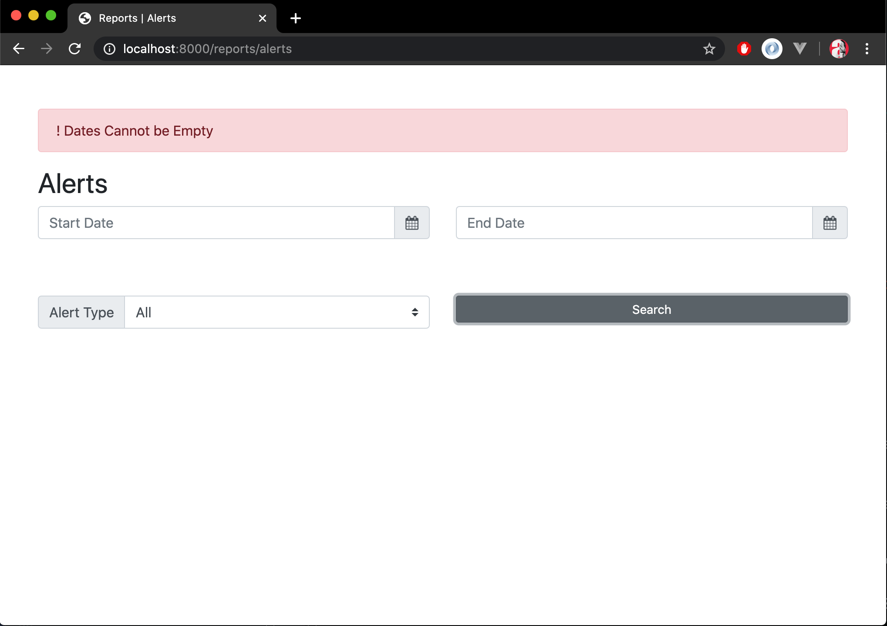
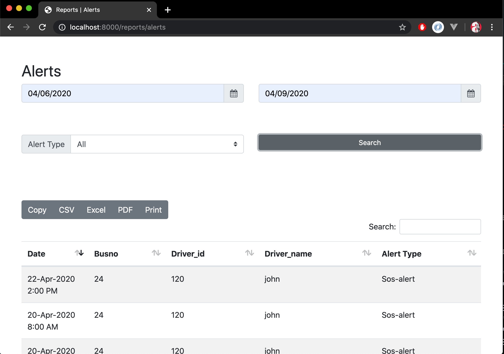
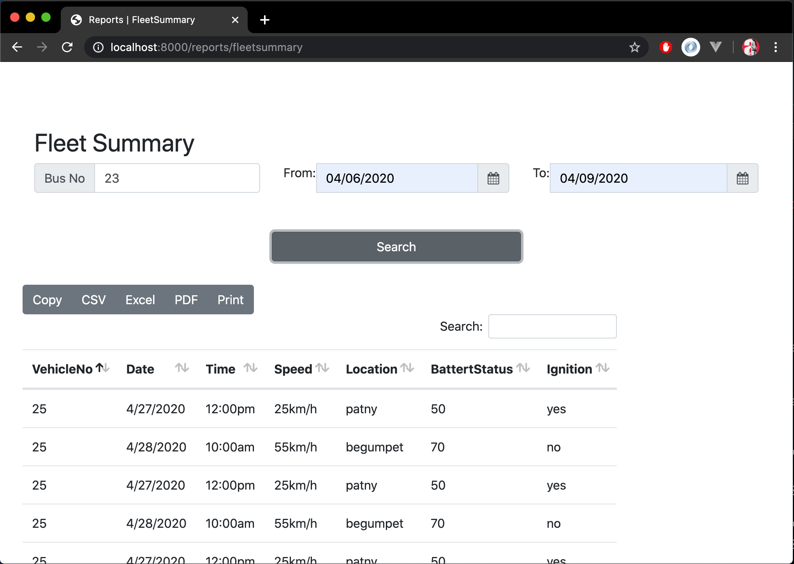
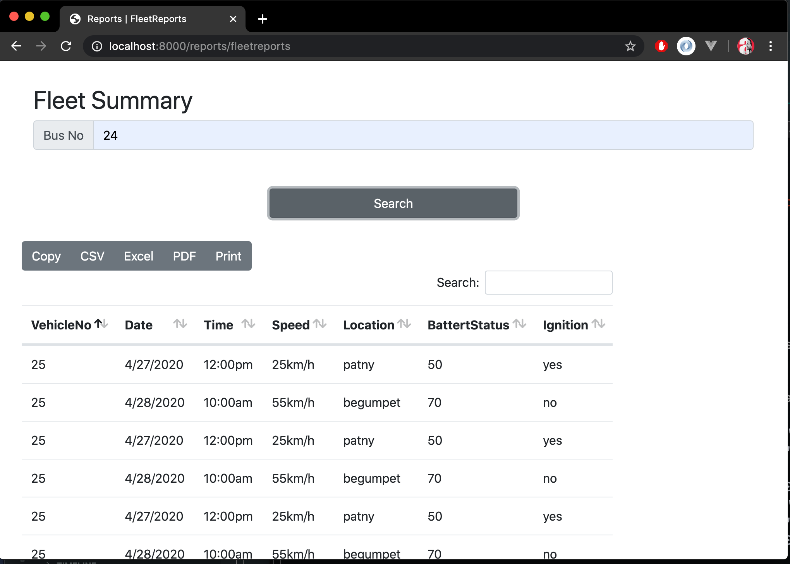

## This project is done as part of internship. Here I develop screens by fetching data from a flask backend.
### Efficiently Handled Client Side Pagination using AJAX Datatables, Error Handling and Error Messages.
Languages and Frameworks Used : HTML, CSS, AJAX, DJANGO.

 
 

# Screen 1

 
 

# Screen 2

 
 

# Screen 3

